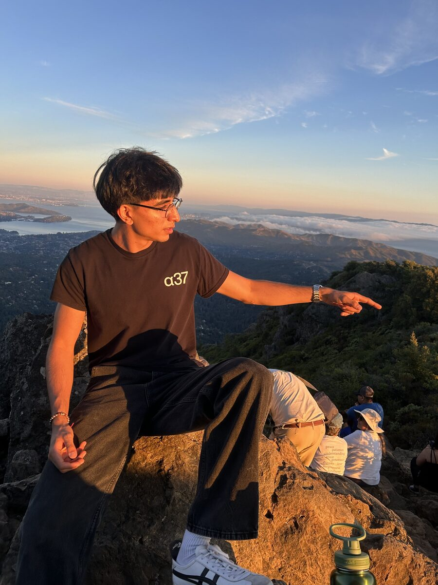
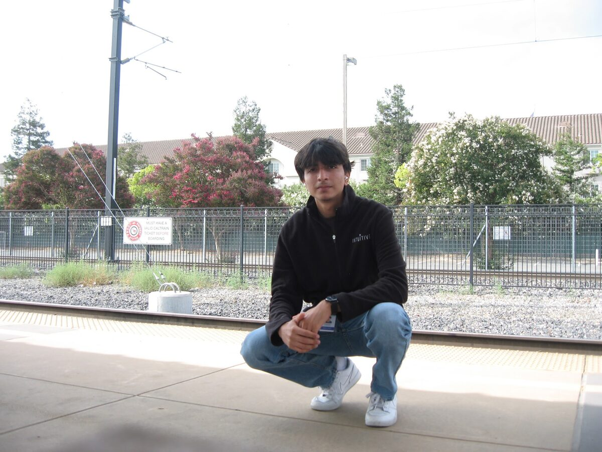

  

    
    <figcaption>
      iPhone 14
      
        <a href="https://maps.app.goo.gl/7sNL6tS9UixZxcZ58" style="color: #3b82f6; text-decoration: none;" target="_blank" rel="noopener noreferrer">East Peak</a>
      
      Sep 2025
    </figcaption>
  

  

    
    <figcaption>
      Canon SD550
      
        <a href="https://maps.app.goo.gl/HMkfLKEZBVn7gbCc6" style="color: #3b82f6; text-decoration: none;" target="_blank" rel="noopener noreferrer">Sunnyvale Caltrain</a>
      
      Aug 2024
    </figcaption>
  

Professional stuff on socials. But here's a bit more:

- born in India, moved shortly after
- childhood spent in Midwest, Pune, LA
  - in that respective order
- high school + undergrad in the Bay

I enjoy:

- biking and walking with music
- helping other people
- discovering new music
- meticulously organizing

I like:

- sunday resets
- sunny in winter time
- every-day carry gear
- a clean [desk setup](/tools)

