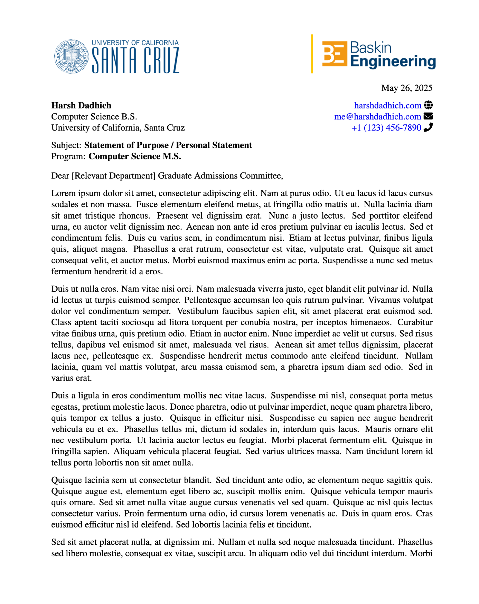

I like to use LaTeX a lot (shoutout AI IDEs): for my resume, letterheads, even cheatsheets; I've made some cool ones I've attached here, feel free to use them!

  

    

      <a href="https://github.com/hdadhich01/resume?tab=readme-ov-file" target="_blank" rel="noopener noreferrer" class="!no-underline !text-inherit decoration-transparent">1. Resume</a>
    

    
  

  

    

      <a href="https://github.com/hdadhich01/letterheads/" target="_blank" rel="noopener noreferrer" class="!no-underline !text-inherit decoration-transparent">2. MS/PhD Application Letterhead</a>
    

    
  

