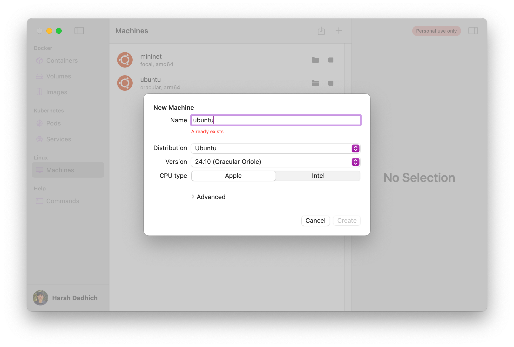

Fed up with clunky **Multipass**, **UTM**, or **VirtualBox** setups for school/work?

Let's get set up in <u>minutes</u> with a much better alternative!

- Works on ** Macs** with **Apple Silicon** (M-series) or **Intel** chips
  - emulate both `arm` and `x86` arch
- copy/paste between Mac and VM
- setup in <5m, instant bootup


Looking for a setup guide to a <b>UCSC Class</b>? Skip to [here](#ucsc-classes-setup)


## Prerequisites

Very simple, caveman clicks button and installs:

- Install XQuartz (**if GUI needed**): [xquartz.org](https://www.xquartz.org/)
- Install OrbStack (VM): [orbstack.dev](https://orbstack.dev)
- Visual Studio Code
  - Install [Remote - SSH](https://marketplace.visualstudio.com/items?itemName=ms-vscode-remote.remote-ssh)

## Create VM

Default settings are fine

If you were mid-way through a class lab setup, skip back to it on the right



## Connect to VM

### Default

If you only have 1 VM, double-click it in OrbStack or `ssh orb` from a terminal

### Multiple

If you have multiple, for the default just do like done [above](#default), but for another do:

```bash
ssh <vmname>@orb
```

or just double-click in OrbStack

## GUI

### Installation

Inside the VM, run this:

```bash
sudo apt install -y openssh-server xauth x11-apps nscd
```

**What is this doing?**

- `openssh-server`: Enables remote SSH access
- `xauth`: Manages X11 forwarding auth
- `x11-apps`: Provides basic X11 GUI tools
- `nscd`: Grants browsers access to the internet

### Setup

Still in the VM, run this:

```bash
sudo vim /etc/ssh/sshd_config
```

This brings up config, find and ensure these lines are set like this:

helpful: `i` to edit, `:wq` to save + exit, `:q!` to force quit without save if you mess up

```plaintext
X11Forwarding yes
X11DisplayOffset 10
X11UseLocalhost yes
```

Now saved, let's reload:

```bash
sudo systemctl restart ssh
```

Let's set a password (anything is fine, just remember it):

```bash
sudo passwd $USER
```

Let's also allow browsers to use the GUI:

```
echo 'export XAUTHORITY=$HOME/.Xauthority' >> $HOME/.profile
```

### Connect (w/GUI)

**Important**: Make sure you're doing this inside a fresh new MacOS terminal (not VM)

Connect with X11 (`-X`) forwarding:

```bash
ssh -X <vmname>.orb.local
```

Note: if you're setting up for CSE 150, **vmname** is `mininet`

### App Usage

Now that you're `ssh -X`'d into the VM, you can run GUI apps!

Run apps (in background):

```bash
app &
```

Replace `app` with the app you want to run, e.g. `wireshark`, `firefox`, `code`, etc.

Also note, bidirectional clipboard is supported!

- <kbd>Command</kbd> + <kbd>C</kbd> to copy on MacOS
- <kbd>Ctrl</kbd> + <kbd>V</kbd> to paste on GUI
- and vice versa

## **Code in VSCode**

Here's how to edit in VSCode if you're a Vim hater

1. Install [Remote - SSH](https://marketplace.visualstudio.com/items?itemName=ms-vscode-remote.remote-ssh)
2. Open VSCode, click TV icon on left sidebar **or** left-most-bottom icon

#### Default

If you only have 1 VM, it should already show up as `orb`, just click it and you're in

#### Multiple

If you have multiple, for the default just connect to `orb`, but for another do:

1.  Connect to Host
2.  Add New SSH Host
3.  `ssh vmname@orb`
4.  <kbd>Cmd</kbd> + <kbd>Shift</kbd> + <kbd>P</kbd>, type in "**Install code PATH**" and enter
5.  Now just open up a fresh terminal
6.  Do as you please, use `code <filepath>` to open stuff in VSCode

#### with GUI

Now sometimes, you want to avoid having a seperate terminal, and separate VSCode

- Why?
  - The seperate terminal is where you `ssh -X ...`
    - this means **GUI enabled**
  - VSCode's connection is just a regular `ssh ...`

First, install the [Remote X11](https://marketplace.visualstudio.com/items?itemName=spadin.remote-x11-ssh) extension

Then do the steps [above](#multiple), but replace **#3** with `ssh -X vmname.orb.local`

Only caveat is you have to input your password every time you open VSCode (you'll live)

## UCSC Classes Setup

Many programming classes require a Linux VM, let's get set up!

Skip to the class you want:

- [CSE 13S, 101, 130](#cse-13s-101-130) (C/C++)
- [CSE 30, 40, 140/X, 183](#cse-30-40-140x-183) (Python)
  - any class that uses `python3` really
- [CSE 150](#cse-150) (Mininet + Wireshark)

### SSH Setup

Let's link up your VM to your [git.ucsc.edu](https://git.ucsc.edu) or GitHub account

Generate a new SSH key:

```bash
ssh-keygen -t rsa -b 4096 -C "OrbStack" -N ""
```

Add the key to your SSH agent:

```bash
eval $(ssh-agent -s)
ssh-add ~/.ssh/id_rsa
```

Now let's grab the public key:

```bash
cat ~/.ssh/id_rsa.pub
```

Now add the output of this to:

- **Preferences > SSH Keys > Add new key** if on [git.ucsc.edu](https://git.ucsc.edu)
- **Settings > SSH and GPG Keys > New SSH key** (or login and click [this](https://github.com/settings/keys)) if on GitHub

You can name the key whatever, I just go with `OrbStack`

### **CSE 13S, 101, 130**

For **C/C++** based classes

1. Do [prereqs](#prerequisites) (**GUI not needed**), create the VM like done [here](#create-vm), then come back here

2. Simply `ssh orb`, then run the following:

```bash
sudo apt install clang clang-format clang-tools make net-tools valgrind
```

1. Setup SSH to hook up to your class repo(s) like done [here](#ssh-setup)

2. Setup to code through VSCode like done [here](#code-in-vscode)

Some VSCode extensions to make your life easier:

- [C/C++ Extension Pack](https://marketplace.visualstudio.com/items?itemName=ms-vscode.cpptools-extension-pack) Syntax highlighting
- [Error Lens](https://marketplace.visualstudio.com/items?itemName=usernamehw.errorlens) See errors without hovering
- [Clang-Format](https://marketplace.visualstudio.com/items?itemName=xaver.clang-format) Auto-formatting
  - <kbd>Cmd</kbd> + <kbd>Shift</kbd> + <kbd>P</kbd> and type in "**Format Document With**"
  - **Configure Default Formatter** > Set to **clang-format**
  - Go to editor settings, search for and enable "**Format on Save**"

### **CSE 30, 40, 140/X, 183**

1. Do [prereqs](#prerequisites) (**GUI not needed**), create the VM like done [here](#create-vm), then come back here

2. Simply `ssh orb`, then run the following:

```bash
sudo apt install python3-dev python3-venv python3-pip python-is-python3
```

1. Setup SSH to hook up to your class repo(s) like done [here](#ssh-setup)

2. Setup to code through VSCode like done [here](#code-in-vscode)

Some VSCode extensions to make your life easier:

- [Python Extension Pack](https://marketplace.visualstudio.com/items?itemName=donjayamanne.python-extension-pack) Syntax highlighting
- [Python Auto Venv](https://marketplace.visualstudio.com/items?itemName=WolfiesHorizon.python-auto-venv) Auto-activate venvs
- [Jupyter](https://marketplace.visualstudio.com/items?itemName=ms-toolsai.jupyter) Support for`.ipynb` notebooks
- [Black Formatter](https://marketplace.visualstudio.com/items?itemName=ms-python.black-formatter) Auto-formatting
  - <kbd>Cmd</kbd> + <kbd>Shift</kbd> + <kbd>P</kbd> and type in "**Format Document With**"
  - **Configure Default Formatter** > Set to **black**
  - Go to editor settings, search for and enable "**Format on Save**"

#### FAQ

1. Sometimes `.ipynb` / notebooks don't load, do this:

```bash
pip install ipykernel --break-system-packages # don't worry lol
```

2. Here's how to set up a virtual environment (venv) for your class:

For starters, `cd` into your project dir and create a venv:

```bash
python -m venv venv # the second 'venv' is the name, can be anything
```

Now activate it:

```bash
source venv/bin/activate
```

Now you can install packages:

```bash
pip install <package>
# or
pip install -r requirements.txt
```

### **CSE 150**

1. Do [prereqs](#prerequisites) (**GUI needed**), then come back here

2. Since manual config sucks, here's a faster way with a [cloud-init](https://cloudinit.readthedocs.io/en/latest/) script:


Setup Script


- Click **Raw** and then <kbd>Command</kbd> + <kbd>S</kbd>
- Save as `cloud-init.yml` under `~/Desktop` (make sure to add the `.yml`)

3. Once done, open up a terminal and run:

```bash
cd ~/Desktop
orb create -a amd64 -c cloud-init.yml ubuntu:focal mininet
```

What's happening here?

- `orb create`: Creates a new instance
- `-a amd64`: Specifies the architecture: `arm64` (ARM) or `amd64` (x86)
  - **Why not latest?** The labs used x86
- `-c cloud-init.yml`: Specifies the cloud-init file to use
- `ubuntu:focal`: Specifies the Ubuntu version (focal for 20.04)
  - **Why not latest?** The labs used 20.04 (as of W25)
- `mininet`: Specifies the name of the instance

It'll take <5m to install + config

4. Still need to do a little bit of manual config, SSH into it:

```bash
ssh mininet@orb
```

5. We need to change the password to `ssh -X` into it later:

```bash
sudo passwd $USER # set as whatever, just remember it
```

6. Nearing the end, just need to install wireshark:

```
sudo apt install -y wireshark
```

Select **yes** on **purple screen prompt** with <kbd>←</kbd> key + <kbd>return</kbd> key (enter)

7. Almost done, just need to adjust perms and clone the POX controller:

```bash
sudo usermod -aG wireshark $(whoami)
git clone https://github.com/noxrepo/pox.git
chmod +x ~/pox/pox.py
```

8. Done! **First** type in `exit`, and then connect using the instructions [here](#connect-wgui)
9. Also, read **entirely** through [App Usage](#app-usage)

#### FAQ

- Note that instead of `chromium`, this script uses `firefox` for the browser

  - doesn't make a difference, it's just faster

- For OpenFlow labs, use this filter in Wireshark:

```
openflow_v1
```

- Sometimes your POX controller might be already binded to a port on a re-reun:

```
sudo kill -9 $(sudo lsof -ti :6633)
```
