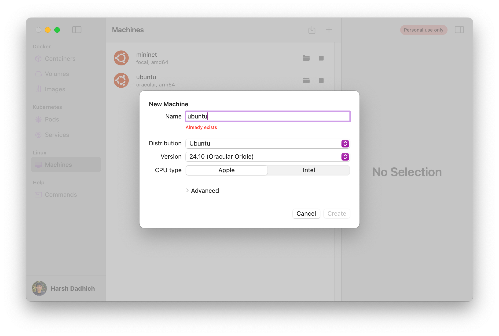

Fed up with clunky **Multipass**, **UTM**, or **VirtualBox** setups for school/work?

Let's get set up in minutes with a much faster, lighter alternative!

- Works on **Apple Silicon** (M1...)
  - emulate both `arm` and `x86_64` arch
- copy/paste between Mac and VM
- setup in <5m, instant bootup


Looking for a <b>CSE 13S/101/130/150</b> setup guide? Do [prereqs](#prerequisites) and skip to [here](#ucsc-class-labs-setup)


## Prequisites

Very simple, caveman clicks button and installs:

- Install XQuartz (GUI): [xquartz.org](https://www.xquartz.org/)
- Install OrbStack (VM): [orbstack.dev](https://orbstack.dev)
- Visual Studio Code
  - Install [Remote - SSH](https://marketplace.visualstudio.com/items?itemName=ms-vscode-remote.remote-ssh)

Please drag to `/Applications` folder

## Create the OrbStack Instance



## Connect to the Instance

Either `ssh mininet@orb` from a terminal or double-click **mininet** in OrbStack

## Installation

Inside the VM, run this:

**Note**: Please select yes on purple screen prompt

```bash
sudo apt install openssh-server xauth x11-apps -y
```

**What is this doing?**

- `openssh-server`: Enables remote SSH access
- `xauth`: Manages X11 forwarding auth
- `x11-apps`: Provides basic X11 GUI tools

## GUI Setup

Still in the VM, run this:

```bash
sudo vim /etc/ssh/sshd_config
```

This brings up config, find and ensure these lines are set like this:

helpful: `i` to edit, `:wq` to save + exit, `:q!` to force quit without save if you mess up

```plaintext
X11Forwarding yes
X11DisplayOffset 10
X11UseLocalhost yes
```

Now saved, let's reload:

```bash
sudo systemctl restart ssh
```

Let's set a password (anything is fine, just remember it):

```bash
sudo passwd $USER
```

Let's also allow Chrome to use the GUI:

```
echo 'export XAUTHORITY=$HOME/.Xauthority' >> $HOME/.profile
```

## Connect to the VM with GUI

Pretty much done atp, let's connect!

**Important**: Close the VM's terminal tab, and open a new one (MacOS, not VM)

### **Quick Option**

Connect with X11 (`-X`) forwarding):

```bash
ssh -X mininet.orb.local
```

### **Better Option**

1. Edit SSH config:

```bash
vim ~/.ssh/config
```

2. Add (make sure to add your username):

```
Host mininet
    HostName mininet.orb.local
    User <your-username>
    ForwardX11 yes
```

3. Connect!

```bash
ssh mininet
```

## GUI Usage

Run apps (in background):

```bash
app &
```

Replace `app` with the app you want to run, e.g. `wireshark`, `firefox`, `code`, etc.

Also note, bidirectional clipboard is supported! Make sure to use the <kbd>Control</kbd> instead of <kbd>Command</kbd> on the GUI to copy/paste.

### **Code in VSCode**

Below stuff is optional, it's just to edit stuff in VSCode

1. Install [Remote - SSH](https://marketplace.visualstudio.com/items?itemName=ms-vscode-remote.remote-ssh)
2. Install [Remote X11](https://marketplace.visualstudio.com/items?itemName=spadin.remote-x11-ssh)
3. Open VSCode, click TV icon on left sidebar **or** bottom & left-most icon

#### Default VM

If you only have 1 VM, it should already show up as `orb`, just click it

#### Multiple VMs

If you have multiple, for the default just connect to `orb`, but for another do:

1.  Connect to Host
2.  Add New SSH Host
3.  `ssh vmname@orb`
4.  `Cmd+Shift+P`, type in "Install code PATH" and enter
5.  Now just open up a fresh terminal
6.  Do as you please, use `code <filepath>` to open stuff in VSCode

#### with GUI

Now sometimes, you want to avoid having a seperate terminal, and separate VSCode

- Why?
  - The seperate terminal is where you `ssh -X ...`
    - this means **GUI enabled**
  - VSCode's connection is just a regular `ssh ...`

So let's just replace **#3** above with `ssh -X vmname.orb.local`

## UCSC Class Labs Setup

Many lab assignments require a VM setup, here's some helpful guides

### CSE 13S, 101, 130

Doesn't require a GUI, so set up like done [here](#create-the-orbstack-instance) (default settings are fine)

Simply `ssh orb`, then run the following:

```bash
sudo apt install clang clang-format clang-tools make net-tools valgrind
```

Now let's set up SSH to allow access to [git.ucsc.edu](https://git.ucsc.edu)

```bash
ssh-keygen -t rsa -b 4096 -C "OrbStack" -N ""
```

Add the key to ssh agent:

```bash
eval $(ssh-agent -s)
ssh-add ~/.ssh/id_rsa
```

Now add the output of below to **Preferences > SSH Keys > Add new key** on [git.ucsc.edu](https://git.ucsc.edu)

```bash
cat ~/.ssh/id_rsa.pub
```

Now you're done, you should see `orb` in your SSH hosts on VSCode

Simply connect, and install these to make your life easier:

- [C/C++ Extension Pack](https://marketplace.visualstudio.com/items?itemName=ms-vscode.cpptools-extension-pack) Syntax highliting
- [Clang-Format](https://marketplace.visualstudio.com/items?itemName=xaver.clang-format)
  - `Cmd+Shift+P` and type in "Format Document With"
  - Configure Default Formatter > Set to Clang-format
- [Error Lens](https://marketplace.visualstudio.com/items?itemName=usernamehw.errorlens)

### CSE 150

The labs for this class require a GUI for wireshark + browser

Since it's a lot of install steps, here's a [cloud-init](https://cloudinit.readthedocs.io/en/latest/) script I made to speed it up

Click **Raw** and then <kbd>Command</kbd> + <kbd>S</kbd> to save the file under `/Desktop`


Setup Script


Once done, open up a terminal and run:

```bash
cd ~/Desktop
orb create -a amd64 -c cloud-init.yml ubuntu:focal mininet
```

What's happening here?

- `orb create`: Creates a new instance
- `-a amd64`: Specifies the architecture (arm64 or amd64 for x86-64)
  - **Why not latest?** The labs seem to x86 arch, so I'm matching it
- `-c cloud-init.yml`: Specifies the cloud-init file to use
- `ubuntu:focal`: Specifies the Ubuntu version (focal for 20.04)
  - **Why not latest?** The labs seem to use 20.04 (as of W25), so I'm matching it
- `mininet`: Specifies the name of the instance

It'll take under <5m to install, then SSH into it:

```bash
ssh mininet@orb
```

We need to change the password to `ssh -X` into it later:

```bash
sudo passwd $USER
```

Almost done, just need to install wireshark:

Select **yes** on **purple screen prompt** with left arrow key + enter

```
sudo apt install wireshark -y
```

Almost there, just need to adjust perms and clone the POX controller:

```bash
sudo usermod -aG wireshark $(whoami)
git clone https://github.com/noxrepo/pox.git
chmod +x ~/pox/pox.py
```

All done, now connect using the instructions [here](#connect-to-the-vm-with-gui)

And also, read entirely through [GUI Usage](#gui-usage)

#### FAQ

For OpenFlow labs, use this filter in Wireshark:

```
openflow_v1
```

Sometimes your POX controller might be already binded to a port on a re-reun:

```
sudo kill -9 $(sudo lsof -ti :6633)
```
