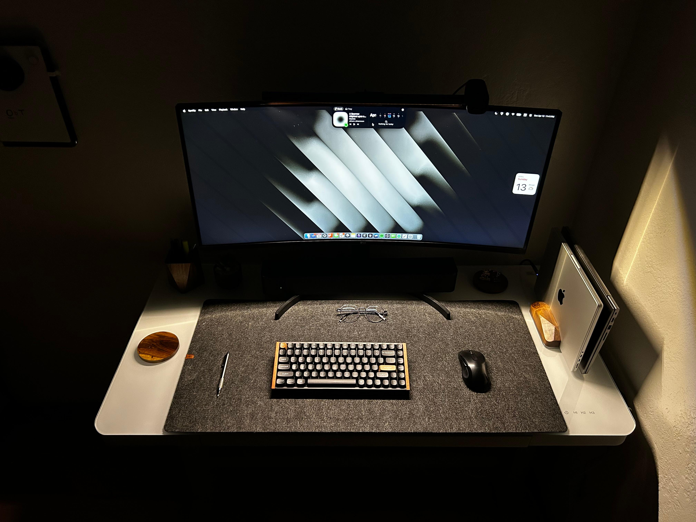

Some are daily drivers, others for occasional tasks, few for utility

  
  <figcaption style="margin-top: -25px; font-size: 0.75em; display: flex; justify-content: center; align-items: center;">
    all this to watch YouTube
  </figcaption>

## Workflow

- [Shortwave](https://shortwave.com) (smart email)
- [Fantastical](https://flexibits.com/fantastical) (calendar + tasks)
- [Cardhop](https://flexibits.com/cardhop) (better contacts)
- [Zen Browser](https://zen-browser.app) (arc, but firefox)
- [Todoist](https://todoist.com) (todos with priority)
- [Obsidian](https://obsidian.md) (note-taking)
- [1.1.1.1](https://1.1.1.1) (public Wi-Fi use)
- [CleanShot X](https://cleanshot.com) (quick clips)
- [Chorus](https://melty.sh/chorus) (multi-AI chat)

## Dev

- [Warp](https://www.warp.dev) (terminal)
- [Tower](https://www.git-tower.com) (git history)
- [OrbStack](https://orbstack.dev) (quick VMs)
- [Cursor](https://cursor.com) (code editor)
- [Zed](https://zed.dev) (light code editor)
- [WakaTime](https://wakatime.com) (time tracking; my [profile](https://wakatime.com/hdadhich01))
- [GitFront](https://gitfront.io) (repo sharing)
- [Cork](https://corkmac.app) (homebrew stuff)
- [Termius](https://termius.com) (SSH + SFTP)
- [OpenInTerminal](https://github.com/Ji4n1ng/OpenInTerminal) (for Finder)

## Lifestyle

- [Endel](https://endel.io) (focus music)
- [Overlap](https://www.joinoverlap.com/) (podcast reels)
- [Hevy](https://hevy.app) (track workouts)
- [SuppCo](https://supp.co) (log supps)

## Finance

- [Roi](https://getroi.app/) (track investments)
- [SplitMyExpenses](https://splitmyexpenses.com)

## Misc

stays in bg, pretty light on resources

- [Swish](https://highlyopinionated.co/swish) (window tiling)
- [Hand Mirror](https://handmirror.app) (webcam peek)
- [Ice](https://github.com/jordanbaird/Ice) (cleaner menu bar)
- [NotchNook](https://lo.cafe/notchnook) (cleaner nook)
- [Maccy](https://maccy.app) (clipboard history)
- [BatFi](https://micropixels.gumroad.com/l/batfi) (battery protection)
- [ColorSlurp](https://colorslurp.com) (color picker)
- [Numi](https://numi.app) (NLP calculator)
